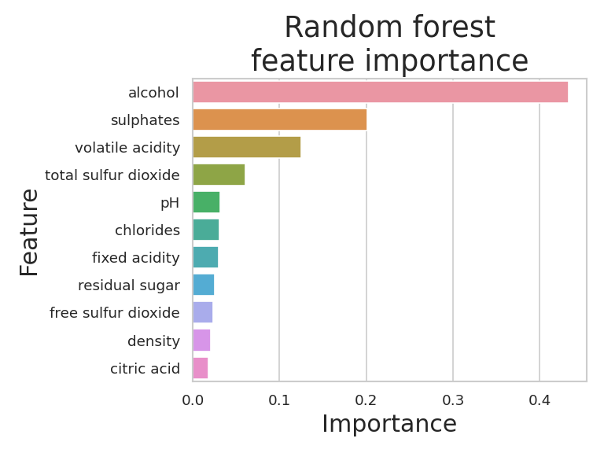
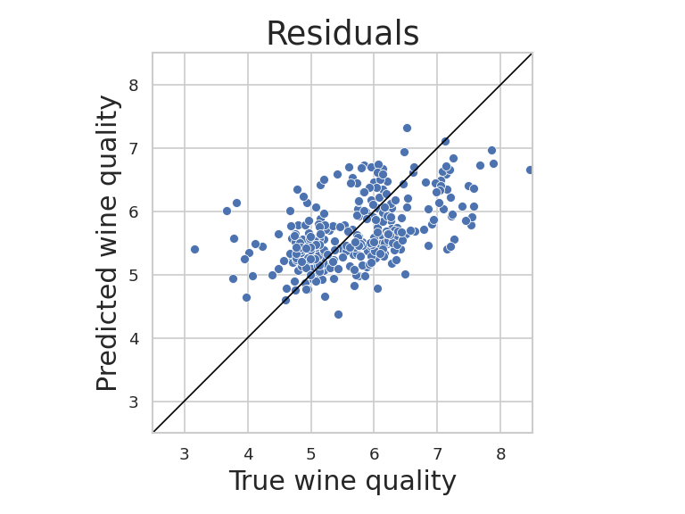

# Wine quality prediction
Modelling a Kaggle dataset of [red wine properties and quality ratings](https://www.kaggle.com/uciml/red-wine-quality-cortez-et-al-2009). 

## we have Deploy simple Random Forest Regression Model With CI/CD with github 

## when we changes code and Commit code it will automatically perfrom machine learning Operation with Change effect 

